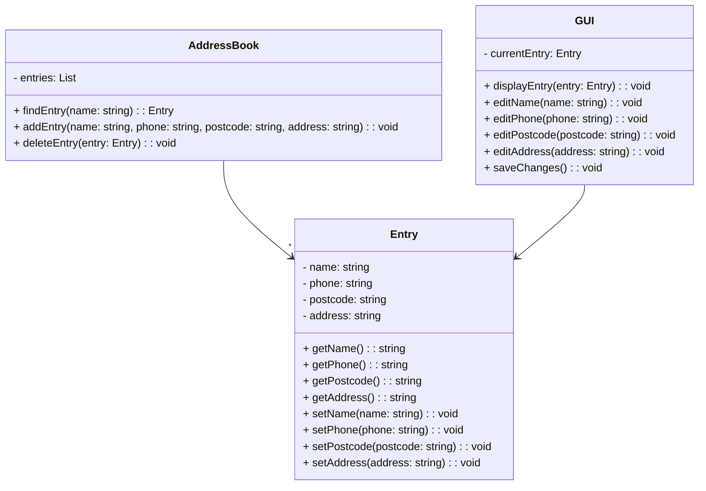

$$
1^2=1
$$


>[!info]
>this is a info


| row | row | fdasf |
| ---- | ---- | ---- |
| fdasf | afdaf | fasdf |
| 1 | hello | fdsaas |

# 一级标题

## 二级标题

### 三级标题

#### 四级标题

##### 五级标题

###### 六级标题

*斜体*
**加粗**
==高亮==

%%注释%%
$a^5-3+4$


---


```python
def hello(){
	print("hello")
}
```
`<script></script>`

- 无序标题
1. 有序标题

